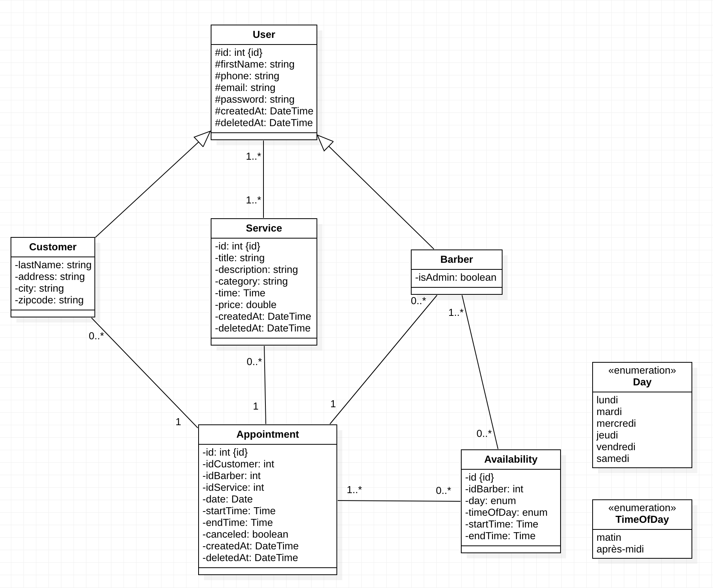

# Chewbacca

Site web pour le barber shop Chewbacca permettant aux clients de se renseigner sur les prestations, les coordonnées et de prendre rendez-vous.

## Fonctionnalités

Un client ne peut prendre rendez-vous que s'il possède un compte et est connecté. Il peut parcourir ses différents rendez-vous. Il peut accéder aux informations d'un rendez-vous ou l'annuler.

Un barbier connecté peut consulter son planning, accéder aux informations d'un rendez-vous ou décider de l'annuler.

Le compte d'un barbier est créé et configuré par le barbier administrateur (préalablement inscrit dans la base de données).

Chaque utilisateur connecté peut modifier ses informations personnelles.

## Technologies

Ce site web est réalisé avec les langages HTML, CSS, JavaScript, PHP, les framework Symphony et BootStrap et la police Font Awesome.

### Diagramme de classes

## Auteurs

* Eviatar Houri alias eviatar75
* Seohyun Park alias soyamimi
* Simon Daniel alias simsam2831
* Léa Da Costa alias dacostal